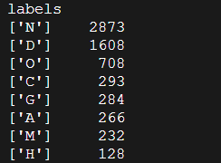
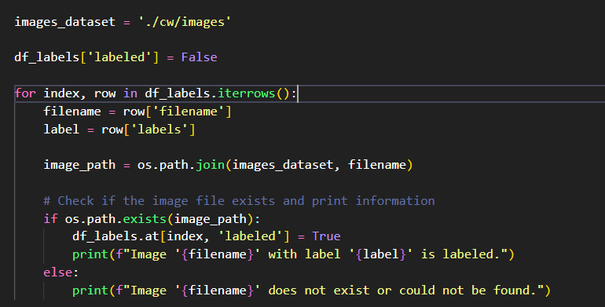
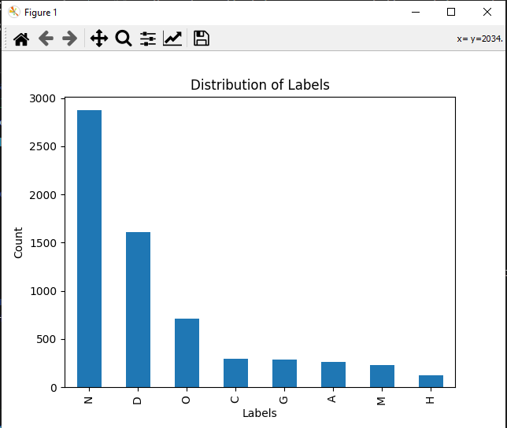

# Title, including module IN3062 or INM701

**Authors: Bilal Bismillah, Abbib Akram, Ethan Hunt**

[Link to github](https://github.com/Abbib123/IN3062-Introduction-to-AI.git)

## Introduction

Report, introduction: description and motivation of the problem, description of the
dataset including data types (e.g. discrete, continuous) (15%)

## Method

Report, methodology: summary of the models used, with their pros and cons, a
hypothesis statement, description of choice of training and evaluation methodology
(20%)

## Results

Report, results: description and presentation of the output. The code acts as an
appendix to this section, and code quality (e.g. commenting) contributes. (30%)

## Evaluation and Conclusion

Report, evaluation: analysis and critical evaluation of results. (10%)

## References

Reflection and discussion (20%)

